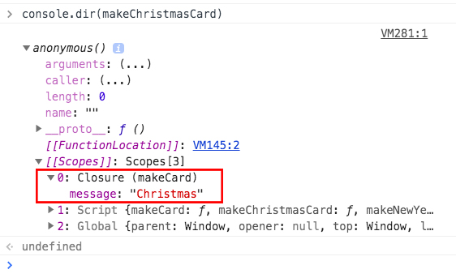
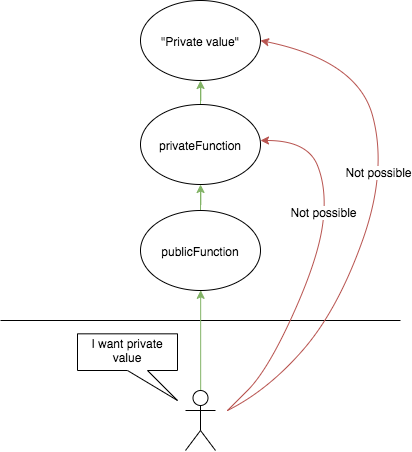

---

### Basics

- Closure = Function + Function's lexical environment
- Closure created every time function created
- To use a closure, define a function inside another function and expose it. To expose a function, return it or pass it to another function.

---

### Some examples of closure

#### Example 1

- A simple case where closure is in action, but not noticed

```js
function init() {
  var name = 'Mozilla'; // name is a local variable created by init
  function displayName() {
    // displayName() is the inner function, a closure
    console.log(name); // Output - Mozilla
  }
  displayName();
}
init();
```

- Here the the displayName function is able to access `name` because of closure

#### Example 2

- Another example where we can see the closure

```js
const makeCard = message => {
  return () => '<---- Happy ' + message + ' ---->';
};
//--------------------
const makeChristmasCard = makeCard('Christmas');
const makeNewYearCard = makeCard('New Year');
//--------------------
makeChristmasCard(); //returns - <---- Happy Christmas ---->
makeNewYearCard(); //returns - <---- Happy New Year ---->
```

- Here the makeChristmasCard access the `message` from closure
- We can see the closure by console makeChristmasCard



---

### Common use cases of closure

#### 1. Data privacy

- Closures are commonly used to give objects data privacy

```jsx
const a = (() => {
  const privateFunction = () => 'Private value';
  const publicFunction = () => privateFunction();
  return { publicFunction };
})();

a.publicFunction(); //returns - Private value
```



- Here the Private value is only accessable through by calling a.publicFunction(), which calls privateFunction which exists in closure

#### 2. Callback functions

- Closures are frequently used to store extra information in callback functions inside event listners, timers etc

```jsx
function initButtons() {
  var body = document.body,
    button,
    i;

  for (i = 0; i < 4; i++) {
    button = document.createElement('button');
    button.innerHTML = 'Button ' + i;
    button.addEventListener('click', e => {
      alert(i);
    });
    body.appendChild(button);
  }
}
initButtons();
```

- Here `alert(i)` is excecuted when the event listener is fired

    <style type="text/css">
  .tg  {border-collapse:collapse;border-spacing:0;}
  .tg td{font-family:Arial, sans-serif;font-size:14px;padding:10px 5px;border-style:solid;border-width:1px;overflow:hidden;word-break:normal;border-color:black;}
  .tg th{font-family:Arial, sans-serif;font-size:14px;font-weight:normal;padding:10px 5px;border-style:solid;border-width:1px;overflow:hidden;word-break:normal;border-color:black;}
  .tg .tg-0lax{text-align:left;vertical-align:top}
  .tg .tg-0pky{border-color:inherit;text-align:left;vertical-align:top}
  .table-container {width: 100%;overflow: scroll;}
    
  </style>
  <div class="table-container">
  <table class="tg">
    <tr>
      <th class="tg-0lax"><span style="font-weight:bold">innerHTML</span></th>
      <th class="tg-0lax"><span style="font-weight:bold">Event listner</span></th>
      <th class="tg-0lax"><span style="font-weight:bold">Closure</span></th>
    </tr>
    <tr>
      <td class="tg-0pky">Button 0</td>
      <td class="tg-0pky">addEventListener("click", (e)=&gt;alert(i));</td>
      <td class="tg-0pky">{i:0}</td>
    </tr>
    <tr>
      <td class="tg-0pky">Button 1</td>
      <td class="tg-0pky">addEventListener("click", (e)=&gt;alert(i));</td>
      <td class="tg-0pky">{i:1}</td>
    </tr>
    <tr>
      <td class="tg-0pky">Button 2</td>
      <td class="tg-0pky">addEventListener("click", (e)=&gt;alert(i));</td>
      <td class="tg-0pky">{i:2}</td>
    </tr>
    <tr>
      <td class="tg-0pky">Button 3</td>
      <td class="tg-0pky">addEventListener("click", (e)=&gt;alert(i));</td>
      <td class="tg-0pky">{i:3}</td>
    </tr>
  </table>
    </pre>

- The value of `i` is stored in closure

---

### Reference

- https://stackoverflow.com/a/19668562/10041165
- https://stackoverflow.com/a/2728341/10041165
- https://developer.mozilla.org/en-US/docs/Web/JavaScript/Closures
