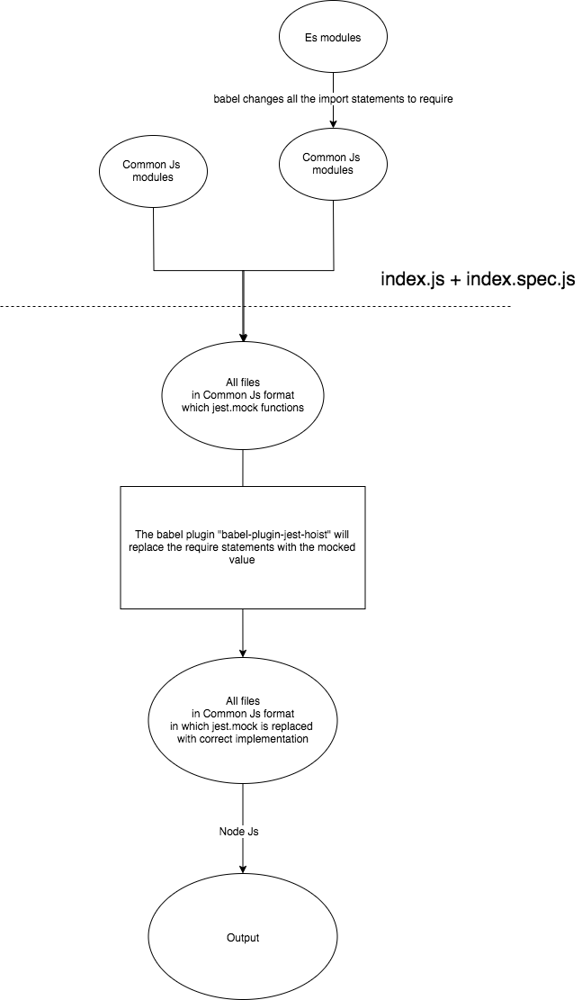

---

### Jest.mock()

- Jest.mock is the inevitable jest api when unit testing javascript
- It can be configured to mock module.export, named export, default exports etc

---

### How jest replaces this

#### Step 1. Making the AST

- Node will only understand the es5
- For this we need some compiler - here we use babel for converting all these file to es5
- Setting up babel configuration for the test environment will depends upon the project

#### Step 2. Replacing with the mock

- This is the important step
- Here the AST created in step one is modified
- This is done by the plugin `babel-plugin-jest-hoist`
- The mock functions replaces the actual code

#### Step 3. Create code

- Here according to the new AST code is generated

### A sample jest.mock code

<iframe class="gist" frameborder="0" srcDoc="

"></iframe>

### Reference

- https://stackoverflow.com/a/19668562/10041165
- https://stackoverflow.com/a/2728341/10041165
- https://developer.mozilla.org/en-US/docs/Web/JavaScript/Closures
