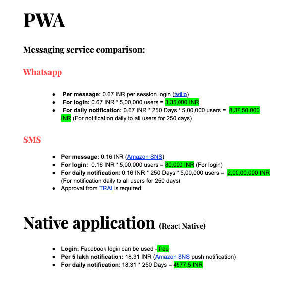

---

### Background

I was part of a team which was responsible to build a prayer application for an organization, the major point to be noted are:

- Expected scale was 5 Lakh user, and they are located in different countries.
- On an average one notification to be send daily to all users for 280 days. 
- The time to deliver is `ASAP`.

---

### What made us thought of PWA.

- Our applicaiton is not so complex.
- PWA will be quicker to develop and releases. (We had time constraints)
- Support for desktop users was a plus.
- Easy to share. 
- For the notifications we can use whatsapp messages, that will be more engaging. (Push notifications for the PWA is not that great)

### Feasiblity study.

The difference in estimated cost was:

PWA-Whatsapp : PWA-SMS : React-Native-Push-Notification :: 84085000 : 20080000 : 4577.5 :: 18369 : 4386 : 1

### Decision

- The cost difference for implementation was significant. 
- So, Eventhough we didn't wanted to travel throught ios and android review paths, we changed our minds.

### Conclusion

- Hope that we can come back to this post when PWA is matured to sending push notifiaction in ios.
- If you think there is any other better way, please tweet me @amaljoseami. 

Untill next decision
Cheers
Amal Jose 